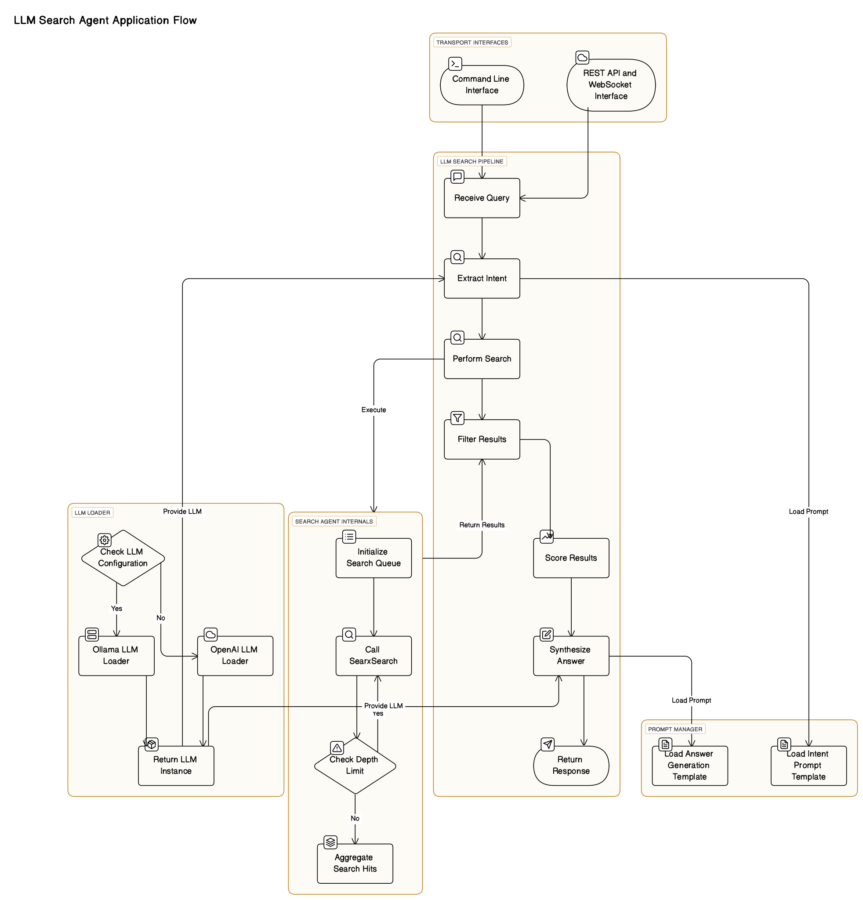

# LLM Search Agent

Performs an agent‑driven web search, that can be used both for the user as well as provide a knowdlege base for LLMs to provide answers that are not accessible trough sheer training alone.

This tool was created because I was frustrated with the quality of current attempts of a "web-search" in the LLM sector (not just, but especially looking at Open-Source). It aims to generate a better web search experience to provide a better knowledge base for LLMs to generate their answers.

For example when you search for a specific package in Python, or even better provide a direct link it should be able to scan that link and follow it properly with specific agents that properly extract information from git-repos or documentation, not just randomly google stuff. Furthermore it should answer just as intended in the prompt, not just random informations that make non sense.

(Could also be seen as a flexible middleware layer between an LLM engine and a search engine).

**Performs an intent‑driven web search and generates answers via:**

- **LangGraph** for stateful orchestration
- **LangChain** for LLM prompt handling & SearxNG tool
- **BFS/DFS** iterative retrieval with SearxNG suggestions

> **WARNING**: This is currently just a very basic prototype, I will remove this message as soon as I consider it usable / shareable. For example right now it just aimed at one LLM-Engine, which will change in the future enabling the capability to combine various sorts of LLM-Engines, locally or remote alike. But thats not going to come in the first version most likely (not sure about that).

## Supported Technologies

<table border="0" cellspacing="0" cellpadding="5" style="border-collapse:collapse;border:none">
  <tr style="border:none">
    <td valign="top" style="border:none">
      <table>
        <thead>
          <tr><th >LLM-Engine</th><th>Status</th></tr>
        </thead>
        <tbody>
          <tr>
            <td><a href="https://github.com/ollama/ollama">ollama</a></td>
            <td><code>working</code></td>
          </tr>
          <tr>
            <td><a href="https://platform.openai.com">OpenAI API</a></td>
            <td><code>implemented</code>, <code>unverified</code></td>
          </tr>
        </tbody>
      </table>
    </td>
    <td valign="top" style="border:none">
      <table>
        <thead>
          <tr><th>Search Engine</th><th>Status</th></tr>
        </thead>
        <tbody>
          <tr>
            <td><a href="https://github.com/searxng/searxng">SearXNG</a></td>
            <td><code>development</code></td>
          </tr>
        </tbody>
      </table>
    </td>
    <td valign="top" style="border:none">
      <table>
        <thead>
          <tr><th>Transport Layer</th><th>Status</th></tr>
        </thead>
        <tbody>
          <tr><td>CLI Conversations</td><td><code>working</code></td></tr>
          <tr><td>HTTP REST API</td><td><code>implemented</code>, <code>testing</code></td></tr>
          <tr><td>WebSocket-Server</td><td><code>implemented</code>, <code>testing</code></td></tr>
        </tbody>
      </table>
    </td>
  </tr>
</table>

## Application Flow

## Current planning and outlook

> I just want to have one prompt and get the results aggregated, cleaned up and spoonfeeded - reliabily (because I`m lazy).

The basic idea behind this all are pipelines. One pipeline per intent. So say you want to search for Code you have a Code-Pipeline. If you search for Technical Documentation you will have a Tech Doc Pipeline. If you search for Research Papers you will search for Research Papers (and only that). So you are going to have a specific Pipeline. That given - this does sound complex - and somewhat you could theoretically already do by manually controlling the Search Engines there are but it should be as transparent as possible and as easy as possible. 

So my idea would be implementing that first in a specific way that it works automatically by intent extraction from the user prompt and afterwards move that towards having the ability to create your own pipelines for very specific tasks that are tailored to your workflow and use-case - the user itself (likely .yml or .toml). Technically speaking it might be smart to not just connect to one Engine on both ends but rather enable combinations of local LLM and remote LLM-Engines in parallel.

We should not blindfool ourselves into propitary (LLM) Search Engines because we`re then very fragile with the outcome, not on a day by day basis but rather more like on a minute by minute basis. The Model changes, they filter stuff, making matters worse - having the reliability that the functionality would not change or break completely. I will likely not implement a Frontend for this. What I would want to do is implement this first into something like [open-webui](https://github.com/open-webui/open-webui), for example trough a simple function against our API. 

I basically created this because I`m curiously interested in that topic for a longer time now, and feel like I can learn something from this.

## Functionality

- **Intent extraction** via LangChain's `LLMChain`
- **Web search retrieval** via LangChain's `SearxSearchWrapper`
- **Result filtering, scoring, and accumulation**
- **Answer synthesis** via LangChain's `LLMChain`
- **Multiple transport connectors**: CLI, HTTP REST API, WebSocket

## Setup
1. Clone the repo
2. Adjust `.env` as required (check `config.py` for possible config)
3. Run `poetry install` in Terminal

## Usage via Terminal
| Command              | Description        |
|----------------------|--------------------|
| `poetry run cli`     | Start all Services |
| `poetry run cli cmd` | Commandline REPL   |
| `poetry run cli api` | HTTP REST API      |
| `poetry run cli ws`  | WebSocket API      |
